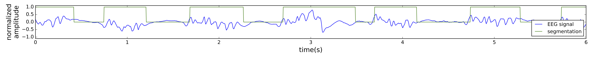
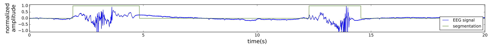

# Burst suppression detector

Burst-suppression is a classic pattern in ICU EEG. This repository re-implements using a very simple algorithm based on thresholding local variance, and described in _Real-time segmentation of burst suppression patterns in critical care EEG monitoring, Westover et al., 2013_. Compared to the orignal article, here we also reject segmented periods shorter than 0.2 seconds (they are usually artefactual). 

# Dependencies

pyedflib, matplotlib, numpy

# Data

You can use records with burst-suppression from the [TUH Abnormal EEG Corpus](), or use another EDF file with burst suppression patterns. Link of the record to use in the `parameters` section of `main.py`. 

# Example segmented records

6-second extract of a record with short and frequent bursts:

20-second extract of a record with longer and more spaced bursts:

